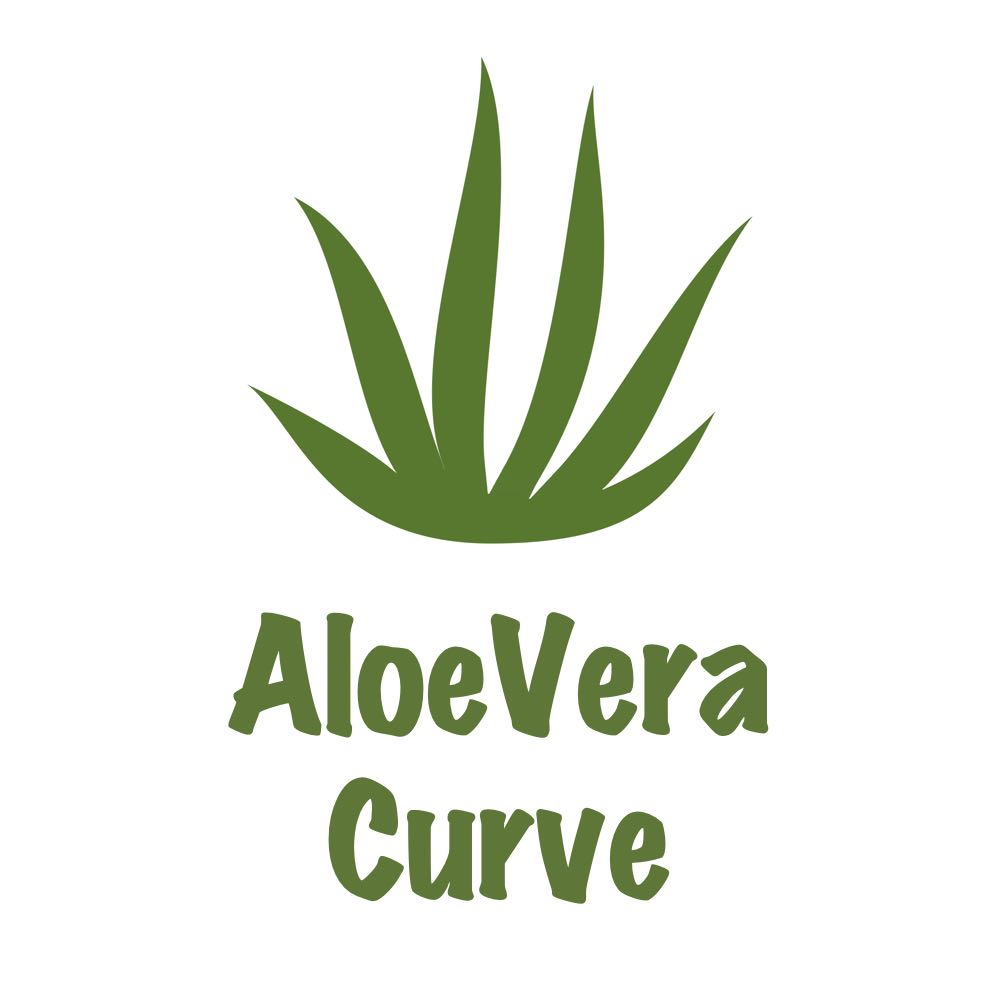
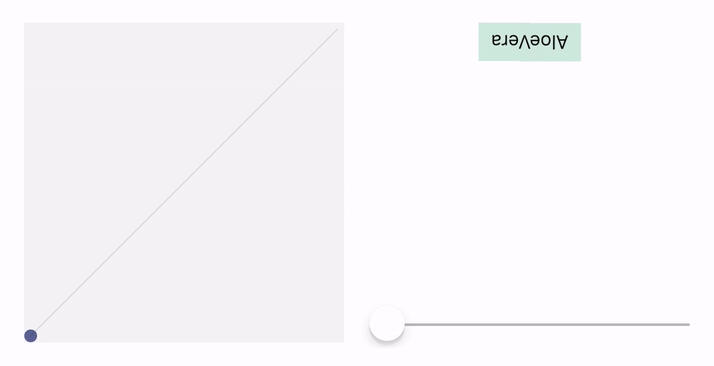
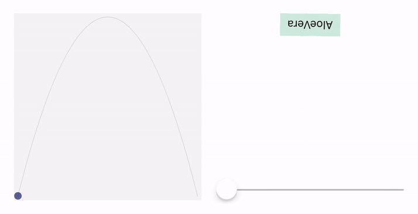

<p align="center">

</p>

# **Polynomial Curves**

## **Line Curve**

Create a line curve function with any two points on it and get the `y` coordinate at any given `x`


```swift
let curve = try polynomialLineCurveFor(point1: CGPoint(x: 2, y: 0),
                                       point2: CGPoint(x: 7, y: 10))
print(curve(4)) // gives 4
print(curve(-1)) // gives -6
```

### Practical Example

Changing the position, scale and rotation of a label with a slider



```swift
// Define the curves as instance variables
positionCurve = try polynomialLineCurveFor(point1: CGPoint(x: 0, y: 0), // Keep label at original position
                                           point2: CGPoint(x: 1, y: 150)) // Move label 150 pt down
scaleCurve = try! polynomialLineCurveFor(point1: CGPoint(x: 0, y: 1), // Kepp label at original size
                                         point2: CGPoint(x: 1, y: 2)) // Double the label size
rotateCurve = try! polynomialLineCurveFor(point1: CGPoint(x: 0, y: -CGFloat.pi), // Flip the label
                                          point2: CGPoint(x: 1, y: 0)) // Revert label orientation to normal

// Then in the `sliderValueChanged` function
let position = positionCurve(progress)
let scale = scaleCurve(progress)
let rotate = rotateCurve(progress)
        
label.transform = CGAffineTransform(translationX: 0, y: position)
                    .scaledBy(x: scale, y: scale)
                    .rotated(by: rotate) 
```

## **Parabola Curve**

Create a parabola curve function with any three points on it and get the `y` coordinate at any given `x`


```swift
let curve = try polynomialParabolaCurveFor(point1: CGPoint(x: 0, y: 0),
                                           point2: CGPoint(x: 6, y: 6), 
                                           point3: CGPoint(x: 8, y: 16))
print(curve(2)) // -2
print(curve(-2)) // 6
```

### Practical Example

Changing the position, scale and rotation of a label with a slider
**(Note that the label reach the maximum transform value in the middle of the slider and not at the end as in the line curve)**



```swift
// Define the curves as instance variables
positionCurve = try! polynomialParabolaCurveFor(point1: CGPoint(x: 0, y: 0), // Keep label at original position
                                                point2: CGPoint(x: 0.5, y: 150), Move label 150 pt down at 0.5 of the progress
                                                point3: CGPoint(x: 1, y: 0)) // Return back label to original position
scaleCurve = try! polynomialParabolaCurveFor(point1: CGPoint(x: 0, y: 1), // Kepp label at original size
                                             point2: CGPoint(x: 0.5, y: 2), // Double the label size at 0.5 of the progress
                                             point3: CGPoint(x: 1, y: 1)) // Return back label to original size
rotateCurve = try! polynomialParabolaCurveFor(point1: CGPoint(x: 0, y: -CGFloat.pi), // Flip the label
                                              point2: CGPoint(x: 0.5, y: 0), // Revert label orientation to normal at 0.5 of the progress
                                              point3: CGPoint(x: 1, y: -CGFloat.pi)) // Flip the label again

// Then in the `sliderValueChanged` function
let position = positionCurve(progress)
let scale = scaleCurve(progress)
let rotate = rotateCurve(progress)
        
label.transform = CGAffineTransform(translationX: 0, y: position)
                    .scaledBy(x: scale, y: scale)
                    .rotated(by: rotate)
```