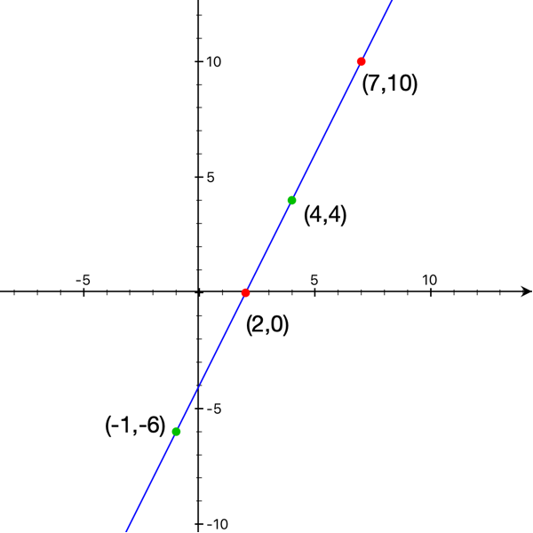
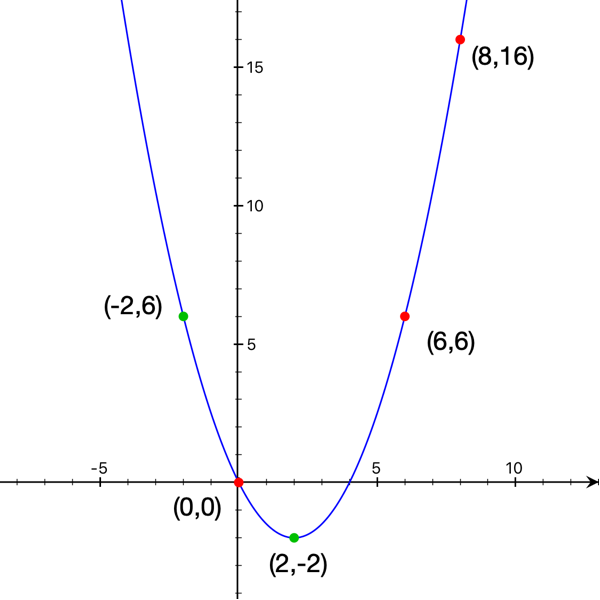

# AloeVeraCurve

Better handling of curves ❤️

## **Polynomial Curves**
### **Line Curve**

Create a line curve function with any two points on it and get the `y` coordinate at any given `x`



```swift
let curve = try polynomialLineCurveFor(point1: CGPoint(x: 2, y: 0),
                                       point2: CGPoint(x: 7, y: 10))
print(curve(4)) // gives 4
print(curve(-1)) // gives -6
```

### **Parabola Curve**

Create a parabola curve function with any three points on it and get the `y` coordinate at any given `x`



```swift
let curve = try polynomialParabolaCurveFor(point1: CGPoint(x: 0, y: 0),
                                           point2: CGPoint(x: 6, y: 6), 
                                           point3: CGPoint(x: 8, y: 16))
print(curve(2)) // -2
print(curve(-2)) // 6
```